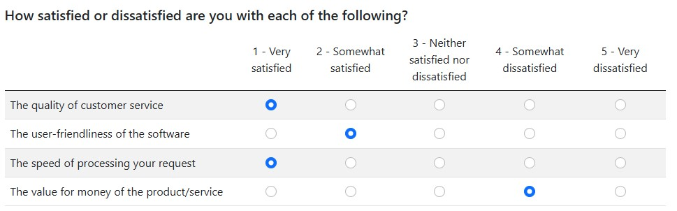

# Survey Matrix Template for oTree 5

This project provides a survey template that uses a matrix-style layout to 
collect responses. 
Each question is represented as a row, and the columns display predefined response options.

## How to Use
1. Pass the survey questions and options to the template via `form_fields`.
2. Customize the styles by editing the `block styles` section.
3. 
4. Add questions manually as rows in the HTML structure.
   - Each question is represented by a `<tr>` element in the `<tbody>` of the table.
   - Response options are added as `<td>` elements containing radio buttons.

## Help
If you have any questions, please feel free to contact me via my [homepage](https://www.studies-services.de/en).
